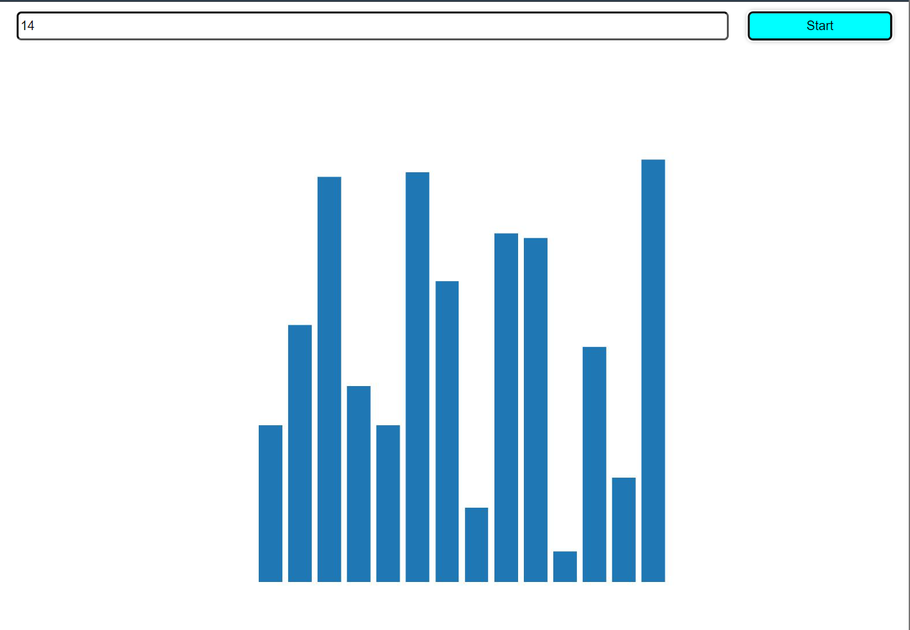

# Overview

This is a companion repo with a source code for my article [Creating a Chimera From 3 Languages and Having Fun Along the Way: Calling Rust From Python From Javascript](http://knidarkness.dev/posts/2024-03-12-calling-rust-from-python-from-javascript/).

## Build & Run

To build everything run the `build.sh` script. To run the demo just serve the contents of the root folder of this repo. I prefer using `npx serve .`.